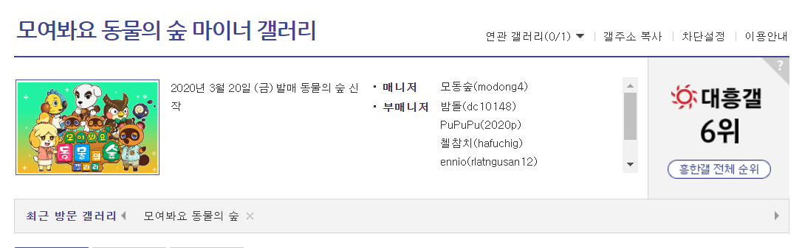
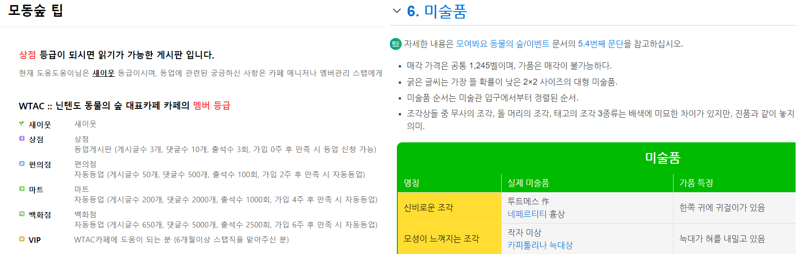
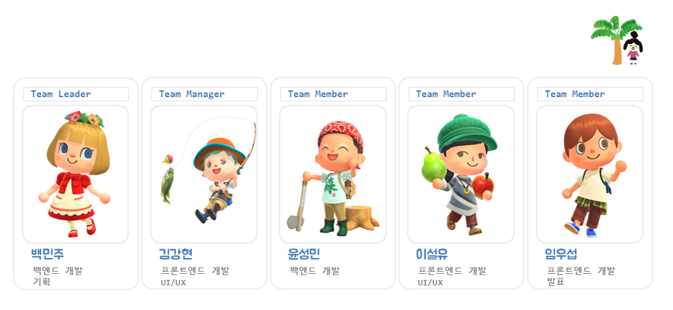
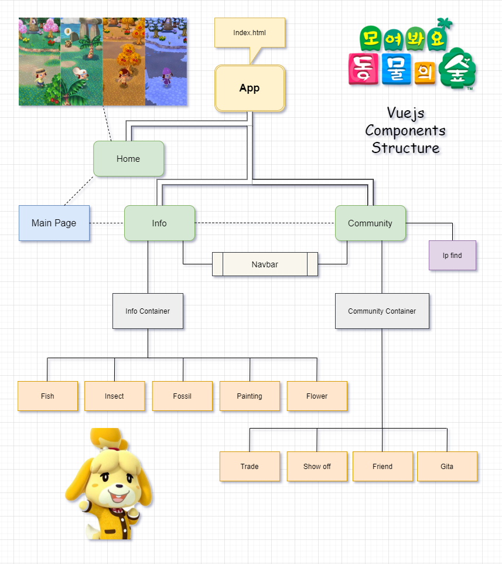

# 공략해요 동물의 숲

## 프로젝트 개요

### 1-1. 주제 선정 배경 및 시장 분석

1) 트렌드 동향

  - 동물의 숲 게임이 인기가 날로 상승하면서 관련 정보와 커뮤니티를 찾는 유저들이 많아지고 있다.

2) 국내/외 현황

  - 2020년 전세계에서 가장 많이 트윗된 게임 1위. 

  - 게임 커뮤니티에서 동물의 숲에 대해 소통하려는 사람들이 많아지고 있다. (게임 타이틀 1300만개 이상 팔림)

3) 벤치마킹 또는 유사 서비스 사례 소개

  - 공략 + 커뮤니티 기능을 동시에 !

  - 보통 공략을 보고 싶으면 나무위키를 이용하고 커뮤니티 기능을 이용하고 싶으면 다른 사이트를 이용했으나 두개 다 제공하는 사이트가 있으면 편하겠다고 생각하게 되었다. 

| 종류                | 장점                                                         | 단점                                         |
| ------------------- | ------------------------------------------------------------ | -------------------------------------------- |
| 나무위키            | 회원가입 절차 없이 누구나 정보를 열람 가능 세세한 정보 제공 | 정보 검색이 불편 가독성이 떨어진다      |
| 네이버 카페 WTAC    | 큰 규모(많은 회원) 정보 공유 활발                       | 가입해야 정보 열람 가능 게시판에 의존적 |
| 디시인사이드 갤러리 | 글 65만개 회원가입 절차 불필요                          | 게시판에 의존적                              |

 4) :moneybag: 소비자/시장에 줄 수 있는 가치

- 더 많은 플레이어와 소통할 수 있는 공간 제공

- 원하는 정보를 쉽게 얻을 수 있는 공간 제공

  

5) :star: 향후 전망

- 커뮤니티 성장
- 글로벌 서비스로 성장
- 지속적 업데이트를 통한 서비스 성장

 

### 1-2. 목표

1) 정보(미술품, 꽃, 물고기, 곤충, 주민 등) 도감 

2) 동물의 숲 유저들의 소통 공간(거래, 친목) 구현 

3) 광고 수익

4) 원하는 대로 세상을 구현해서 현실에서 불가능했던 부분들을 동물의 숲에서 자유롭게 구현

### 1-3. 팀원별 담당 역할

# 개발 계획

## 일정 계획 및 담당

### 1주차

| 내용                   | 담당자         |
| ---------------------- | -------------- |
| 프로젝트 기획          | 팀원 전체      |
| 시장 분석 및 목표 설정 | 이설유, 윤성민 |
| 개발 계획 수립         | 김강현         |
| 프로젝트 요구사항 정의 | 임우섭         |
| 프로젝트 아키텍처 구성 | 백민주         |

### 2주차

| 내용                        | 담당자                 |
| --------------------------- | ---------------------- |
| 개발 환경 구성 - 백엔드     | 백민주, 윤성민         |
| 개발 환경 구성 - 프론트엔드 | 이설유, 임우섭, 김강현 |
| 개발: 백엔드 / DB 스키마    | 백민주, 윤성민         |
| 개발: Vue Component 구성    | 이설유, 임우섭, 김강현 |

### 3주차

| 내용                     | 담당자                 |
| ------------------------ | ---------------------- |
| 크롤링 및 데이터 DB 정리 | 백민주, 윤성민         |
| Vuejs 베이스 기능 구현   | 이설유, 임우섭, 김강현 |

### 4주차

| 내용                            | 담당자 |
| ------------------------------- | ------ |
| 회원관리 및 회원용 서비스-back  | 백민주 |
| 회원관리 및 회원용 서비스-front | 임우섭 |
| DB가공 및 관리                  | 윤성민 |
| 물고기/그림/꽃 페이지  구성     | 이설유 |
| 커뮤니티 기능 구성              | 김강현 |

### 5주차

| 내용                     | 담당자                 |
| ------------------------ | ---------------------- |
| Back-end 추가 기능 작업  | 백민주, 윤성민         |
| Front-end 추가 기능 작업 | 이설유, 임우섭, 김강현 |

### 6주차

| 내용                     | 담당자                 |
| ------------------------ | ---------------------- |
| 전체 페이지 기능 보수    | 백민주, 윤성민         |
| 디자인 작업 진행         | 이설유, 임우섭, 김강현 |
| UCC에 필요한 요소들 준비 | 팀원 전체              |

### 7주차

| 내용                          | 담당자    |
| ----------------------------- | --------- |
| 완성된 사이트 리뷰            | 백민주    |
| 개선 사항 추가 개발 작업 진행 | 윤성민    |
| 통합 테스트 및 검토           | 이설유    |
| 발표자료 준비 및 발표연습     | 임우섭    |
| 사이트 런칭과 서버관리        | 김강현    |
| UCC제작                       | 팀원 전체 |

## 개발 언어 및 활용 기술

### Backend

- Python 3.8.2
- SQLite 3.31.1
- Django 3.0.6

### Back-Library(Framework)

- Django-rest-framework 3.11.0
- Selenium 3.141.59
- BeautifulSoup4 4.9.0

### Frontend

- Javascript ECMAScript 2018
- Vuejs 2.6.10

### Frontend-Library(Framework)

- Vuetify 2.2.28
- IPhostentry 
- Firebase Cloud

### Publish & Design

- Adobe Photoshop 21.1.2
- Adobe Illustrator 24.1.2

## :mag_right: 3-1. 요구사항 정의 (Table)

| Req ID |              요구사항 명              | 설명                                                         |
| :----: | :-----------------------------------: | :----------------------------------------------------------- |
| Req 1  |            유저 관리:man:             | - 관리자: 서비스를 관리한다. - 방문자: 고유 ip를 통해 랜덤 닉네임을 부여 받는다. |
|        |             방문자 서비스             | (커뮤니티: 고유 ip로 닉네임 형성 해야 함) - 거래 - 자랑 - 친구 찾기 - 기타  (정보) - 물고기 - 곤충 - 화석 - 미술품 - 꽃 |
|        |                유저 DB                | 유지 관리에 필요한 최소 정보는 필수로 포함 - 방문자 ip (CharField) (자동입력, 랜덤 닉네임 형성에 사용) - 비밀번호 (CharField)  - 악성유저 여부 (IntField) |
| Req 2  |           물고기 조회:fish:           | 크롤링을 통해 가져온 물고기 정보를 보기 편한 UI로 디자인     |
|        |           곤충 조회:beetle:           | 크롤링을 통해 가져온 곤충 정보를 보기 편한 UI로 디자인       |
|        |               물고기 DB               | 물고기 데이터베이스 테이블 만들기  - 물고기 이름 (CharField) - 포획 가능 달 (IntField) - 포획 가능 시간대 (CharField) - 포획 장소 (CharField) - 포획 난이도 (IntField) |
|        |                곤충 DB                | 곤충 데이터베이스 테이블 만들기  - 곤충 이름 (CharField) - 포획 가능 달 (CharField)  - 포획 가능 시간 대 (CharField) |
| Req 3  |            그림 조회:art:             | - 미술관을 구성할 수 있는 특정 그림 수집 방법 소개 - 진품/가품 구분 기준 제공 |
|        |                그림 DB                | 그림 데이터베이스 테이블 만들기  - 그림 제목 (CharField) - 진품 그림 설명 (TextField) - 가품 그림 설명 (TextField) - 구분 방법 (TextField) |
| Req 4  |        꽃 교배:cherry_blossom:        | 가져온 꽃 정보를 기반으로 보기 편한 UI로 제공  - 교배 방법 - 교배 시 나오는 꽃의 종류 - 특정 꽃을 얻는 방법 - 시뮬레이션 기능: 시간이 남으면 도전해볼 것 |
|        |                 꽃 DB                 | 꽃 데이터베이스 테이블 만들기  - 꽃 이름 (CharField) - 꽃 그림 (CharField) - 꽃 종류 (CharField) - 꽃 색깔 (CharField or IntField) - 꽃 세대 (CharField, 교배 여부) |
| Req 5  | 커뮤니티 거래:currency_exchange: | 회원을 위한 동물의숲 커뮤니티 (1) 회원은 거래 커뮤니티에서 본인이 원하는 재화를 얻기 위해 다른 유저와 소통한다. |
|        |               주요 기능               | - 글 작성 - 댓글 작성 - 좋아요 기능 **없음** - 판매자와 수요자 간 1:1 통신 채널 구현 (채팅) - 글 작성자를 누르면 서로 채팅 가능하게 |
| Req 6  |       커뮤니티​ ​자랑:mega:        | 회원을 위한 동물의 숲 커뮤니티 (2) 내 섬의 컨텐츠를 단순히 자랑만 할 수 있는 게시판 |
|        |               주요 기능               | - 글 작성 - 댓글 작성 가능 - 좋아요 기능 **있음** - 게임 내 컨텐츠 캡처 이미지 업로드 기능 구현 필수 (Firebase) - *(필요시 네이버 텍스트 에디터 오픈소스 사용해서 구현)* |
| Req 7  |           커뮤니티:couple:            | 회원을 위한 동물의 숲 커뮤니티 (3) 같은 지역 기반 동물의 숲 유저 찾기 게임친구 :arrow_right: 동네친구 (동네친구 찾기 '위피' 어플에서 착안) |
|        |               주요 기능               | - 구글 지도 API 사용 - 같은 지역 기반 동물의 숲 유저 찾기 - 다른 지역 기반 동물의 숲 유저 찾기 |
| Req 8  |              커뮤니티 DB              | ** **CRUD 기능 제공** **  - 게시글 카테고리 (IntField): 거래, 자랑, 친구 - 게시글 제목 (CharField) - 게시글 내용 (TextField) - 작성자 (CharField): 고유 ip로 형성된 랜덤 닉네임 - 이미지 (CharField): Firebase 이미지 URL - 비밀번호 (​CharField): 게시글 작성 시마다 입력 - 작성 시간 (DateTimeField, auto_now_add=True) - 수정 시간 (DateTimeField, auto_add=True) - 댓글 (CharField) - 게시글 좋아요 기능 (ManyToManyField) |
| Req 9  |       서비스 UX/UI 커스터마이징       | - Web: 동물의 숲 컨셉 + 싸이월드 감성 - Mobile: 프로그레시브웹앱(PWA) |

## 3-2. 요구사항 정의 (ERD, Architecture)

- ERD

  

- Vue Components Structure

  

## PPT 참고