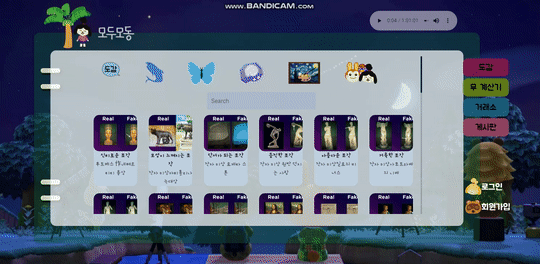

# :cat: 모두모동: 모두 함께 즐기는 모여봐요 동물의 숲

## http://k02a4031.p.ssafy.io/

### 프로젝트 소개 영상 https://www.youtube.com/embed/wCGdJAOtAX4

## 1. 프로젝트 개요

### 1-1. 주제 선정 배경 및 시장 분석

#### 1) 콘솔 게임 트렌드

  - 동물의 숲 게임의 인기가 연일 상승세
  - 동물의 숲 게임 이용 정보와 커뮤니티를 찾는 유저 또한 증가 추세

-----

#### 2) 국내외 현황

  - 2020년 전세계에서 가장 많이 트윗된 게임 1위. 
  - 게임 커뮤니티에서 동물의 숲에 대해 소통하고자 하는 사람들 증가 
    (게임 타이틀 1300만개 이상 팔림)

-----

#### 3) 벤치마킹 / 유사 서비스 사례

- 나무위키: 게임 공략을 보고 싶은 사람들이 이용
  

- 네이버 카페 / DC인사이드: 게임을 함께 이용하는 사람들과 커뮤니케이션
  

- 정리: 이를 통해, 정보와 커뮤니티 서비스를 한 곳에서 제공하는 사이트를 착안
  
  | 종류              | 장점                                       | 단점                                         |
  | ----------------- | ------------------------------------------ | -------------------------------------------- |
  | 나무위키          | 회원가입 절차 불필요 자세한 정보 제공 | 정보 검색이 불편 가독성 떨어짐          |
  | 네이버 카페 WTAC  | 큰 규모(많은 회원) 정보 공유 활발     | 가입해야 정보 열람 가능 게시판에 의존적 |
  | DC인사이드 갤러리 | 글 65만개 회원가입 절차 불필요        | 게시판에 의존적                              |
  

-----

#### 4) :moneybag: 소비자/시장에 줄 수 있는 가치

- 더 많은 플레이어와 소통할 수 있는 공간 제공
- 원하는 정보를 쉽게 얻을 수 있는 공간 제공

-----

#### 5) :star: 향후 전망

- 커뮤니티 성장
- 글로벌 서비스로 성장
- 지속적 업데이트를 통한 서비스 성장

-----

### 1-2. 프로젝트 목표

> 현실에선 불가능 했지만 동물의 숲에서 자신이 원하는 대로, 자유롭게 구현하는 방법(정보)을 제공하고, 함께 서비스를 이용하는 유저들과의 소통(커뮤니티)이 가능한 플랫폼을 제공함으로써 건강한 게임 이용 생태계 조성

#### 1) 정보

  - 미술품, 꽃, 물고기, 곤충, 주민 등 도감 서비스 제공 

-----

#### 2) 커뮤니티

  - 동물의 숲 유저들의 소통 공간(거래, 친목) 구현

-----

#### 3) 광고 수익

- 사이트를 이용하려고 유입되는 유저들에게 지속적 광고 노출
- 서비스 유지를 위한 안정적 수익 확보

-----

### 1-3. 팀원별 담당 역할

-----

## 2. 개발 계획

### 2-1. 일정 계획 및 담당

#### 1주차

| 내용                   | 담당자         |
| ---------------------- | -------------- |
| 프로젝트 기획          | 팀원 전체      |
| 시장 분석 및 목표 설정 | 이설유, 윤성민 |
| 개발 계획 수립         | 김강현         |
| 프로젝트 요구사항 정의 | 임우섭         |
| 프로젝트 아키텍처 구성 | 백민주         |

-----

#### 2주차

| 내용                        | 담당자                 |
| --------------------------- | ---------------------- |
| 개발 환경 구성 - 백엔드     | 백민주, 윤성민         |
| 개발 환경 구성 - 프론트엔드 | 이설유, 임우섭, 김강현 |
| 개발: 백엔드 / DB 스키마    | 백민주, 윤성민         |
| 개발: Vue Component 구성    | 이설유, 임우섭, 김강현 |

-----

#### 3주차

| 내용                     | 담당자                 |
| ------------------------ | ---------------------- |
| 크롤링 및 데이터 DB 정리 | 백민주, 윤성민         |
| Vuejs 베이스 기능 구현   | 이설유, 임우섭, 김강현 |

-----

#### 4주차

| 내용                            | 담당자 |
| ------------------------------- | ------ |
| 회원관리 및 회원용 서비스-back  | 백민주 |
| 회원관리 및 회원용 서비스-front | 임우섭 |
| DB가공 및 관리                  | 윤성민 |
| 물고기/그림/꽃 페이지  구성     | 이설유 |
| 커뮤니티 기능 구성              | 김강현 |

-----

#### 5주차

| 내용                     | 담당자                 |
| ------------------------ | ---------------------- |
| Back-end 추가 기능 작업  | 백민주, 윤성민         |
| Front-end 추가 기능 작업 | 이설유, 임우섭, 김강현 |

-----

#### 6주차

| 내용                     | 담당자                 |
| ------------------------ | ---------------------- |
| 전체 페이지 기능 보수    | 백민주, 윤성민         |
| 디자인 작업 진행         | 이설유, 임우섭, 김강현 |
| UCC에 필요한 요소들 준비 | 팀원 전체              |

-----

#### 7주차

| 내용                          | 담당자    |
| ----------------------------- | --------- |
| 완성된 사이트 리뷰            | 백민주    |
| 개선 사항 추가 개발 작업 진행 | 윤성민    |
| 통합 테스트 및 검토           | 이설유    |
| 발표자료 준비 및 발표연습     | 임우섭    |
| 사이트 런칭과 서버관리        | 김강현    |
| UCC제작                       | 팀원 전체 |

-----

### 2-2. 개발 언어 및 활용 기술

#### 1) Backend

-  Python 3.8.2
-  SQLite 3.31.1
-  Django 3.0.6

-----

#### 2) Back-Library(Framework)

-  Django-rest-framework 3.11.0
-  Selenium 3.141.59
-  BeautifulSoup4 4.9.0

-----

#### 3) Frontend

-  Javascript EDMA Script 2018
-  Vuejs 2.6.10

-----

#### 4) Frontend-Library(Framework)

-  Vuetify 2.2.28
-  IPhostentry
-  Firebase Cloud

-----

#### 5) Publish & Design

-  Adobe Photoshop 21.1.2
-  Adobe Illustrator 24.1.2

-----

## 3. 요구사항 정의  :mag:
### 3-1. Table

1. 유저 관리(ip이용)
2. 물고기, 곤충 조회(도감 및 박물관 채우기용)
3. 그림 및 화석 조회(박물관 채우기 용)
4. 꽃 교배정보 조회(꾸미기 용)
5. 커뮤니티 기능 - 거래, 자랑, 친구찾기 커뮤니티

| Req ID |              요구사항 명              | 설명                                                         |
| :----: | :-----------------------------------: | :----------------------------------------------------------- |
| Req 1  |            유저 관리:man:             | - 관리자: 서비스를 관리한다. - 방문자: 고유 ip를 통해 랜덤 닉네임을 부여 받는다. |
|        |             방문자 서비스             | (커뮤니티: 고유 ip로 닉네임 형성 해야 함) - 거래 - 자랑 - 친구 찾기 - 기타  (정보) - 물고기 - 곤충 - 화석 - 미술품 - 꽃 |
|        |                유저 DB                | 유지 관리에 필요한 최소 정보는 필수로 포함 - 방문자 ip (CharField) (자동입력, 랜덤 닉네임 형성에 사용) - 비밀번호 (CharField)  - 악성유저 여부 (IntField) |
| Req 2  |           물고기 조회:fish:           | 크롤링을 통해 가져온 물고기 정보를 보기 편한 UI로 디자인     |
|        |           곤충 조회:beetle:           | 크롤링을 통해 가져온 곤충 정보를 보기 편한 UI로 디자인       |
|        |               물고기 DB               | 물고기 데이터베이스 테이블 만들기  - 물고기 이름 (CharField) - 포획 가능 달 (IntField) - 포획 가능 시간대 (CharField) - 포획 장소 (CharField) - 포획 난이도 (IntField) |
|        |                곤충 DB                | 곤충 데이터베이스 테이블 만들기  - 곤충 이름 (CharField) - 포획 가능 달 (CharField)  - 포획 가능 시간 대 (CharField) |
|        |              주민정보 DB              | - 주민 이름  - 주민 영어이름   - 주민 성별 - 주민 생일  - 주민 성격   - 주민 종류(개 고양이 등) |
| Req 3  |            그림 조회:art:             | - 미술관을 구성할 수 있는 특정 그림 수집 방법 소개 - 진품/가품 구분 기준 제공 |
|        |                그림 DB                | 그림 데이터베이스 테이블 만들기  - 그림 제목 (CharField) - 진품 그림 설명 (TextField) - 가품 그림 설명 (TextField) - 구분 방법 (TextField) |
| Req 4  |        꽃 교배:cherry_blossom:        | 가져온 꽃 정보를 기반으로 보기 편한 UI로 제공  - 교배 방법 - 교배 시 나오는 꽃의 종류 - 특정 꽃을 얻는 방법 - 시뮬레이션 기능: 시간이 남으면 도전해볼 것 |
|        |                 꽃 DB                 | 꽃 데이터베이스 테이블 만들기  - 꽃 이름 (CharField) - 꽃 그림 (CharField) - 꽃 종류 (CharField) - 꽃 색깔 (CharField or IntField) - 꽃 세대 (CharField, 교배 여부) |
| Req 5  | 커뮤니티 거래:currency_exchange: | 회원을 위한 동물의숲 커뮤니티 (1) 회원은 거래 커뮤니티에서 본인이 원하는 재화를 얻기 위해 다른 유저와 소통한다. |
|        |               주요 기능               | - 글 작성 - 댓글 작성 - 좋아요 기능 **없음** - 판매자와 수요자 간 1:1 통신 채널 구현 (채팅) - 글 작성자를 누르면 서로 채팅 가능하게 |
| Req 6  |       커뮤니티​ ​자랑:mega:        | 회원을 위한 동물의 숲 커뮤니티 (2) 내 섬의 컨텐츠를 단순히 자랑만 할 수 있는 게시판 |
|        |               주요 기능               | - 글 작성 - 댓글 작성 가능 - 좋아요 기능 **있음** - 게임 내 컨텐츠 캡처 이미지 업로드 기능 구현 필수 (Firebase) - *(필요시 네이버 텍스트 에디터 오픈소스 사용해서 구현)* |
| Req 7  |           커뮤니티:couple:            | 회원을 위한 동물의 숲 커뮤니티 (3)                           |
|        |               주요 기능               | - 동물의 숲 유저 글쓰기                                      |
| Req 8  |              커뮤니티 DB              | ** **CRUD 기능 제공** **  - 게시글 카테고리 (IntField): 거래, 자랑, 친구 - 게시글 제목 (CharField) - 게시글 내용 (TextField) - 작성자 (CharField): 고유 ip로 형성된 랜덤 닉네임 - 이미지 (CharField): Firebase 이미지 URL - 비밀번호 (​CharField): 게시글 작성 시마다 입력 - 작성 시간 (DateTimeField, auto_now_add=True) - 수정 시간 (DateTimeField, auto_add=True) - 댓글 (CharField) - 게시글 좋아요 기능 (ManyToManyField) |
| Req 9  |       서비스 UX/UI 커스터마이징       | - Web: 동물의 숲 컨셉 + 싸이월드 감성 - Mobile: 프로그레시브웹앱(PWA) |

## 새로 넣을 것

### 1. 도감

도감을 통해 동물의 숲에서 수집 요소인 물고기, 나비, 화석, 그림(진품과 가품 구별), 주민 정보를 확인할 수 있습니다. 각 수집품 이름과 주민 성격으로 검색을 해 쉽게 정보를 얻을 수 있습니다. 특히 주민의 경우 주민의 성격은 영입의 큰 요소이기에 검색 가능하도록 했습니다.

도감 중 미술품 정보를 통해 진품과 가품을 쉽게 구분할 수 있습니다. 한 미술품 정보를 클릭하면 이에 대한 큰 사진과 진품과 가품의 차이 Text를 보여주어 쉽게 구분 가능하도록 합니다. 미술품 정보를 통해 사용자가 진품을 여울에게 구입해 박물관에 전시할 수 있도록 돕습니다.

### 3-2. ERD, Architecture

#### 1) ERD

  

-----

#### 2) Vue Components Structure

  

## 4. 에필로그

| 김강현 |                                                              |
| ------ | :----------------------------------------------------------: |
| 백민주 | 처음으로 팀장을 하면서 그 무게를 느꼈습니다. 또한 Django를 메인 프레임워크로 이용하며 그 사용법을 자세히 익히게 되었습니다.  사용자 요청에 따른  permission / allow 부분을 잘 설정해야 함을 알게 되었습니다.  마지막 일주일 정도는 프론트엔드 작업을 나누어서 했는데, 프론트에서 처리해야 할 일이  너무 많아서 팀 모두가 고생을 좀 했습니다. 생각보다 짧아진 일정에도 불구하고  마지막 날 디버깅까지 불태워 프로젝트를 잘 마무리할 수 있었습니다. |
| 윤성민 |                                                              |
| 이설유 |                                                              |
| 임우섭 |                                                              |

