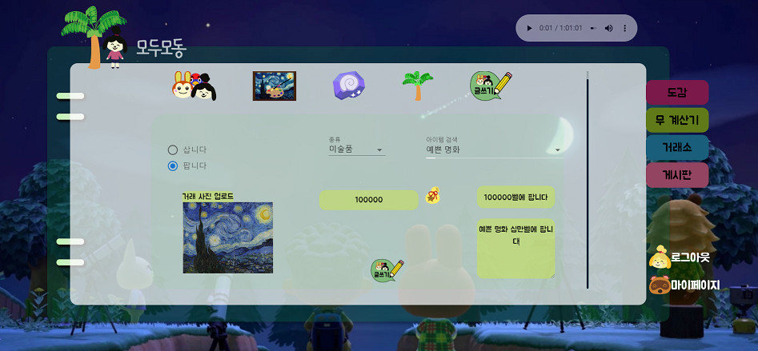

### 3. 거래소

거래소에서 이웃, 미술품, 화석 그 밖에 기타 아이템들을 사고팔 수 있습니다.

글쓰기에서 거래할 아이템을 선택하고 원하는 가격을 제시할 수 있습니다.

댓글을 통해 거래를 원하는 다른 사용자들과 소통할 수 있습니다.

### 후기 추가

모두모동 후기 :cat:

결론 : 모두모동을 만들며 개발자로서의 비전을 구체적으로 키울 수 있었고 훌륭한 개발자가 되고자 하는 의지가 너무 확고해져 버렸다. :feet: 개발 과정에서 여러 차례 몰입하는 과정을 느낄 수 있어서 좋았다. 모두모동 덕분에 즐거웠다. :slightly_smiling_face:

[모두모동]

추후 업데이트를 통해 더 완성도 있게 프로젝트를 개선하고 싶다. 개인 포트폴리오 사이트를 모두모동 클론 코딩(디자인)으로 바꿔야겠다. :computer::paintbrush:

[개발 역량의 성장]

개발 역량은 물론이고 개발자의 태도, 습관 등에서 많은 것을 배울 수 있었다.

프로젝트 기획부터 프로젝트가 끝난 지금까지 팀원들 모두가 개발에 대한 열정과 프로젝트에 대한 애정이 넘쳤는데 그것은 매우 인상 깊은 수준이었다. 화상회의 툴을 이용해 여러 정보를 공유하고 의견을 주고받으며 부족했던 부분들이 채워졌다. 특히 그동안 프론트엔드만 담당하며 백엔드, 배포 등에 대한 경험이 부족했는데 서로 알려주는 시간을 통해 배울 수 있었다.

화면공유를 하며 내가 담당하지 않은 부분에서 코드를 작성하고 수정하는 과정을 실시간으로 볼 수 있어서 프로젝트 전반에 대한 이해도를 높일 수 있었고 문제가 생겼을 때 해결하는 것이 수월했다.

공부해야 할 부분이 어떤 것들인지 깨닫게 되었고 팀원에게 알려주기 위해 알던 내용도 더 깊고 체계적으로 정리할 수 있었다.

[좋은 팀원으로서의 태도]

팀원들이 개발 역량과 협업 능력이 좋고 특별히 잘하는 부분을 가지고 있었다. 그래서 베스트 팀원이 되기 위해, 훌륭한 프로그래머가 되기 위해 어떤 점을 개선해야 할지 내 장점을 어떻게 살릴 것인지 되돌아볼 수 있었다. 그리고 다양한 역할(팀장, 팀 매니저, 팀원 등)에 대해 배울 수 있었다. 팀장인 민주로부터 기획하는 법, 학습 태도, 일정 스케줄링 등을 배우고 성민이 강현이로부터 개발에 대한 지식과 각종 꿀팁을 얻을 수 있었으며 발표를 한 우섭이에게서는 이미지 메이킹, 설득하기, 발표 기획 등에 대해 배울 수 있었다. 

그동안 개인 프로젝트를 할 땐 다양한 역할을 혼자 수행해야해서 부담스러웠는데 이번 프로젝트를 통해 개발 공부를 많이 하고 기획하는 부분에서도 배운 점이 많아 자신감이 생겼다.:1st_place_medal:

[모여봐요 동물의 숲 입문]

팀원 강현이로부터 닌텐도 스위치를 빌려서 모여봐요 동물의 숲을 시작했다. 그래서 프로젝트 진행 중 쉬는 시간마다 틈틈이 했더니 마음이 정화되었다. 나중에 닌텐도 스위치 사면 모두모동을 통해 강현이 닌텐도 스위치에 있는 아이템들을 0원에 거래할 생각이다. :video_game::money :moneybag: