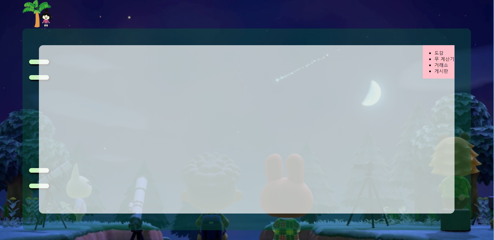

모두모동 레이아웃

## CSS Grid(그리드)

* 2차원(행과 열)의 레이아웃 시스템을 제공  cf) Flexible Box는 1차원 레이아웃
* 파이어폭스 브라우저의 개발자 도구에서 grid 버튼 <- 학습하기 편함


---


CSS Flex와 마찬가지로 Container(컨테이너)와 Item(아이템)으로 구분

* Container : 자식 요소인 Item들을 감싸는 부모 요소. Grid의 영향을 받는 공간
* Item : Grid 규칙에 의해 배치될 자식 요소(들)

```css
.container {
    display: grid;
}
```


---


* 컨테이너에 적용하는 속성

* 아이템에 적용하는 속성


컨테이너에 `display: grid;` 를 적용하는 것이 시작!

```css
.container {
    display: grid;
}
```


그리드 트랙 (Grid Track)은 그리드의 행(Row) 또는 열(Column)

그리드 셀 (Grid Cell)은 그리드 한 칸을 가리킴


컨테이너에 그리드 트랙의 크기를 지정해주기 위해

grid-template-rows(행 배치)와 grid-template-columns(열 배치) 라는 속성을 사용


grid-area 속성으로 아이템에 이름을 붙이고

컨테이너에서 grid-template-areas를 통해 배치한다(빈 영역은 .마침표 사용)


* align-items : 아이템들을 세로(column) 방향 정렬. 컨테이너에 적용.
* justify-items : 아이템들을 가로(row) 방향 정렬. 컨테이너에 적용


---


1. 배경화면 깔고 그리드 적용하기

   ```html
   <!DOCTYPE html>
   <html lang="en">
   <head>
       <meta charset="UTF-8">
       <meta name="viewport" content="width=device-width, initial-scale=1.0">
       <link rel="stylesheet" href="./style.css">
       <title>모두모동</title>
   </head>
   <body>
       <div class="container">
           <div class="logoImage">
               
           </div>
           <div class="boardGreen">
           </div>
       </div>
   </body>
   </html>
   ```

   ```css
   /* 여백 없애기 위해 */
   body {
       margin: 0;
   }
   
   .container {
       background-image: url('./assets/imgs/background.png');
       background-size: cover;
       height: 100vh;
   
       display: grid;
       grid-template-columns: 1fr 20fr 1fr;
       grid-template-rows: 1fr 20fr 1fr;
       grid-template-areas: 
       ". logoImage ."
       ". boardGreen ."
       ". . .";
   }
   
   .logoImage {
       grid-area: logoImage;
   }
   
   .boardGreen {
       grid-area: boardGreen;
       background-color: rgba(10, 85, 56, 0.425);
       border-radius: 15px;
   }
   ```


---


2. 초록색 영역(boardGreen) 그리드 적용 

```html
<!DOCTYPE html>
<html lang="en">
<head>
    <meta charset="UTF-8">
    <meta name="viewport" content="width=device-width, initial-scale=1.0">
    <link rel="stylesheet" href="./style.css">
    <title>모두모동</title>
</head>
<body>
    <div class="container">
        <div class="logoImage">
            
        </div>
        <div class="boardGreen">
            <div class="rings"></div>
            <div class="boardGray"></div>
        </div>
    </div>
</body>
</html>
```

```css
/* 여백 없애기 위해 */
body {
    margin: 0;
}

.container {
    background-image: url('./assets/imgs/background.png');
    background-size: cover;
    height: 100vh;

    display: grid;
    grid-template-columns: 1fr 20fr 1fr;
    grid-template-rows: 1fr 20fr 1fr;
    grid-template-areas:
        ". logoImage ."
        ". boardGreen ."
        ". . .";
}

.logoImage {
    grid-area: logoImage;
}

.boardGreen {
    grid-area: boardGreen;
    background-color: rgba(10, 85, 56, 0.425);
    border-radius: 15px;

    display: grid;
    grid-template-columns: 1fr 25fr 1fr;
    grid-template-rows: 2fr 20fr 2fr;
    grid-template-areas:
        "rings . ."
        "rings boardGray ."
        "rings . .";
}

.rings {
    grid-area: rings;
    background-color: rgba(216, 112, 147, 0.561);
}

.boardGray {
    grid-area: boardGray;
}
```


---


3. 링 만들기

   ```html
   <!DOCTYPE html>
   <html lang="en">
   <head>
       <meta charset="UTF-8">
       <meta name="viewport" content="width=device-width, initial-scale=1.0">
       <link rel="stylesheet" href="./style.css">
       <title>모두모동</title>
   </head>
   <body>
       <div class="container">
           <div class="logoImage">
               
           </div>
           <div class="boardGreen">
               <div class="rings">
                   <div class="ring ring1"></div>
                   <div class="ring ring2"></div>
                   <div class="ring ring3"></div>
                   <div class="ring ring4"></div>
               </div>
               <div class="boardGray"></div>
           </div>
       </div>
   </body>
   </html>
   ```

   ```css
   /* 여백 없애기 위해 */
   body {
       margin: 0;
   }
   
   .container {
       background-image: url('./assets/imgs/background.png');
       background-size: cover;
       height: 100vh;
   
       display: grid;
       grid-template-columns: 1fr 20fr 1fr;
       grid-template-rows: 1fr 20fr 1fr;
       grid-template-areas:
           ". logoImage ."
           ". boardGreen ."
           ". . .";
   }
   
   .logoImage {
       grid-area: logoImage;
   }
   
   .boardGreen {
       grid-area: boardGreen;
       background-color: rgba(10, 85, 56, 0.425);
       border-radius: 15px;
   
       display: grid;
       grid-template-columns: 1fr 25fr 1fr;
       grid-template-rows: 2fr 20fr 2fr;
       grid-template-areas:
           "rings . ."
           "rings boardGray ."
           "rings . .";
   }
   
   .rings {
       grid-area: rings;
   
       display: grid;
       grid-template-rows: 2fr 1fr 1fr 5fr 1fr 1fr 2fr;
       grid-template-areas:
           "."
           "ring1"
           "ring2"
           "."
           "ring3"
           "ring4"
           ".";
   }
   
   .ring {
       width: 120%;
       min-width: 15px;
       height: 30%;
       margin-left: 40%;
       background: linear-gradient(to right, #c2f8b4, #dfe2df);
       border-radius: 50px;
       box-shadow: 3px 3px 3px 2px rgba(8, 8, 8, 0.959);
   }
   
   .ring1 {
       grid-area: ring1;
   }
   
   .ring2 {
       grid-area: ring2;
   }
   
   .ring3 {
       grid-area: ring3;
   }
   
   .ring4 {
       grid-area: ring4;
   }
   
   .boardGray {
       grid-area: boardGray;
       background: rgba(255, 255, 255, 0.705);
       border-radius: 15px;
   }
   ```

   


---


4. 탭 메뉴 만들고 마진 이용해서 세부 수정

   ```html
   <div class="boardGray">
       <!-- 게시판 내용 들어갈 자리 section 태그 사용 -->
   
       <div class="rightTab">
           <ul>
               <li class="illustratedBook">도감</li>
               <li class="calculator">무 계산기</li>
               <li class="exchange">거래소</li>
               <li class="community">게시판</li>
           </ul>
       </div>
   </div>
   ```

   ```css
   .rightTab {
       position: absolute;
       top: 0;
       right: 0;
       background-color: pink;
   }
   ```

   

    

   추가 수정

   ```html
   <!DOCTYPE html>
   <html lang="en">
   <head>
       <meta charset="UTF-8">
       <meta name="viewport" content="width=device-width, initial-scale=1.0">
       <link rel="stylesheet" href="./style.css">
       <title>모두모동</title>
   </head>
   <body>
       <div class="container">
           <div class="logoImage">
               
           </div>
           <div class="boardGreen">
               <div class="rings">
                   <div class="ring ring1"></div>
                   <div class="ring ring2"></div>
                   <div class="ring ring3"></div>
                   <div class="ring ring4"></div>
               </div>
               <div class="boardGray">
                   <!-- 게시판 내용 들어갈 자리 section 태그 사용 -->
   
                   <div class="rightTab">
                       <ul>
                           <li class="illustratedBook">도감</li>
                           <li class="calculator">무 계산기</li>
                           <li class="exchange">거래소</li>
                           <li class="community">게시판</li>
                       </ul>
                   </div>
               </div>
           </div>
       </div>
   </body>
   </html>
   ```

   ```css
   @import url("https://fonts.googleapis.com/css2?family=Jua&display=swap");
   
   /* 여백 없애기 위해 */
   body {
       margin: 0;
   }
   
   .container {
       background-image: url('./assets/imgs/background.png');
       background-size: cover;
       height: 100vh;
   
       display: grid;
       grid-template-columns: 1fr 20fr 1fr;
       grid-template-rows: 1fr 20fr 1fr;
       grid-template-areas:
           ". logoImage ."
           ". boardGreen ."
           ". . .";
   }
   
   .logoImage {
       grid-area: logoImage;
       z-index: 2;
   }
   
   .logoImage img {
       margin-top: 1%;
       margin-left: 4%;
       margin-bottom: -6%;
   }
   
   .boardGreen {
       grid-area: boardGreen;
       background-color: rgba(10, 85, 56, 0.425);
       border-radius: 15px;
   
       display: grid;
       grid-template-columns: 1fr 25fr 1fr;
       grid-template-rows: 2fr 20fr 2fr;
       grid-template-areas:
           "rings . ."
           "rings boardGray ."
           "rings . .";
   
       z-index: 1;
   }
   
   .rings {
       grid-area: rings;
   
       display: grid;
       grid-template-rows: 2fr 1fr 1fr 5fr 1fr 1fr 2fr;
       grid-template-areas:
           "."
           "ring1"
           "ring2"
           "."
           "ring3"
           "ring4"
           ".";
   }
   
   .ring {
       width: 120%;
       min-width: 15px;
       height: 30%;
       margin-left: 40%;
       background: linear-gradient(to right, #c2f8b4, #dfe2df);
       border-radius: 50px;
       box-shadow: 3px 3px 3px 2px rgba(8, 8, 8, 0.959);
   }
   
   .ring1 {
       grid-area: ring1;
   }
   
   .ring2 {
       grid-area: ring2;
   }
   
   .ring3 {
       grid-area: ring3;
   }
   
   .ring4 {
       grid-area: ring4;
   }
   
   .boardGray {
       position: relative;
   
       grid-area: boardGray;
       background: rgba(255, 255, 255, 0.705);
       border-radius: 15px;
   }
   
   .rightTab {
       position: absolute;
       top: 0;
       right: 0;
       margin-right: -8.35%;
   }
   
   ul {
       list-style-type: none;
       text-align: center;
       font-size: 150%;
       font-family: "Jua", sans-serif;
   }
   
   li {
       width: 120px;
       height: 50px;
       line-height: 50px;
       color: black;
       margin-bottom: 5px;
       border-radius: 13px;
   }
   
   .illustratedBook {
       background: #7a194a;
   }
   
   .calculator {
       background: #607a19;
   }
   
   .exchange {
       background: #195e7a;
   }
   
   .community {
       background: #924460;
   }
   ```

   


* 참고하면 좋을 사이트

  https://heropy.blog/2019/08/17/css-grid/
  https://studiomeal.com/archives/533