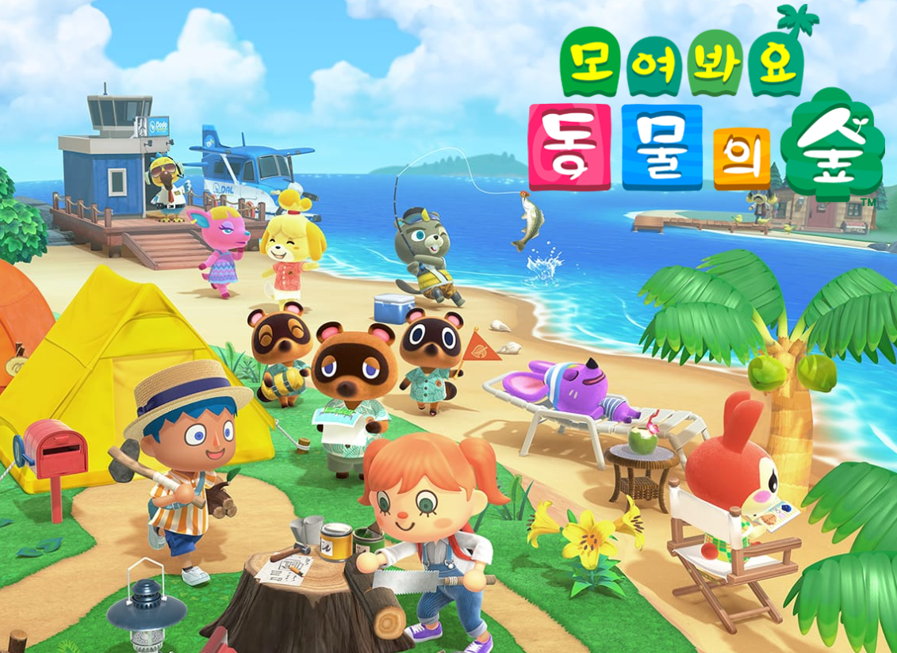

## 프로젝트 개요

### 1-1. 주제 선정 배경 및 시장 분석

1) :video_game: 트렌드 동향

인기 게임 동물의 숲과 관련된 정보와 공략을 찾는 사람들이 늘고 있다.

2) :dizzy: 국내/외 현황

전세계에서 가장 많이 트윗된 게임 1위. 

게임 커뮤니티에서 동물의 숲에 대해 소통하려는 사람들이 많아지고 있다.

3) :bookmark_tabs: 벤치마킹 또는 유사 서비스 사례 소개

| 종류                   | 장점                                                         | 단점                                         |
| ---------------------- | ------------------------------------------------------------ | -------------------------------------------- |
| 나무위키 / 공략 어플들 | 회원가입 절차 없이 누구나 정보를 열람 가능 세세한 정보 제공 | 정보 검색이 불편 가독성이 떨어진다      |
| 네이버 카페 WTAC       | 큰 규모(많은 회원) 정보 공유 활발                       | 가입해야 정보 열람 가능 게시판에 의존적 |
| 디시인사이드 갤러리    | 글 65만개 회원가입 절차 불필요                          | 게시판에 의존적                              |

 4) :moneybag: 소비자/시장에 줄 수 있는 가치

* 더 많은 플레이어와 소통할 수 있는 공간 제공
* 원하는 정보를 손쉽게 얻을 수 있다
* 자신의 성과를 자랑할 수 있는 공간 제공

5) :star: 향후 전망

* 커뮤니티 성장
* 글로벌 서비스로 성장
* 지속적 업데이트를 통한 서비스 성장

 

### 1-2. 목표

1) 정보(미술품, 꽃, 물고기, 곤충, 주민 등) 도감 

2) 동물의 숲 유저들의 소통 공간(거래, 친목) 구현 

3) 광고 수익

원하는 대로 세상을 구현해서 현실에서 불가능했던 부분들을 동물의 숲에서 자유롭게 구현

### 1-3. 팀원별 담당 역할

| 이름   | 역할   | 담당 업무                 |
| ------ | ------ | ------------------------- |
| 백민주 | 팀장   | 팀장. 기획 및 백엔드 개발 |
| 김강현 | 부팀장 | 프론트엔드 개발, UI/UX    |
| 윤성민 |        | 백엔드 개발               |
| 이설유 |        | 프론트엔드 개발, UI/UX    |
| 임우섭 |        | 프론트 엔드 개발, 발표    |

 

