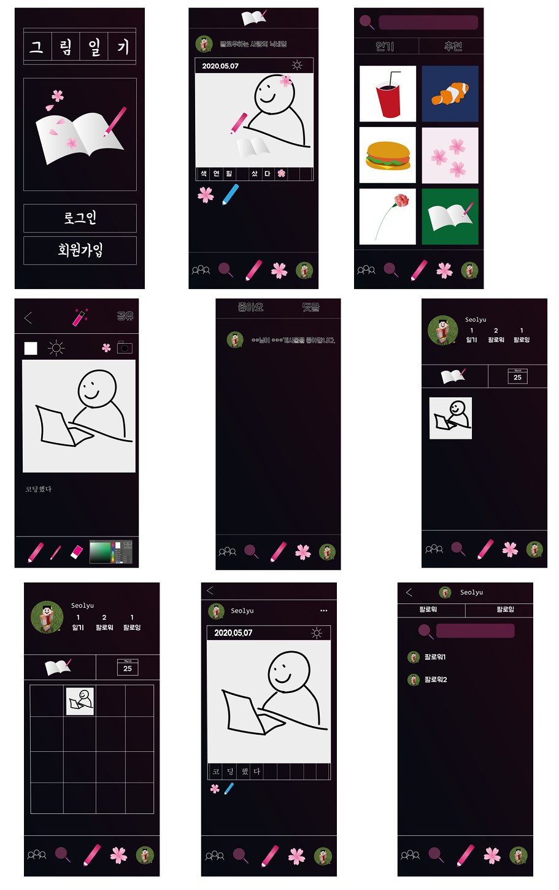

##  20-05-07 회의

줄여진 네 개의 후보 중 두개 선택한 후 한 개 선택


### 후보1 동물의숲 공략 사이트

```
최근에 가장 핫한 게임
나비보벳따우로도 유명한 게임
간단히 말하자면 돈을 벌어서 집을 꾸미고 도감을 채운다
인터넷을 통한 거래도 가능해서 꾸미는 방법이 무궁무진함

-날짜 나누어서: 생물도감 - 곤충, 물고기
-미술품 가짜 진짜 구분
-주민(detail페이지 존재)
-노래(무한반복 제공, 유튜브 음원 가져오기 좋음)
-꽃 교배 정보

내가 실제 이용한 경우: 언제 무슨 생물 잡을 수 있나 도감채우기
미술품 진품 가품 구분할 때
주민 검색 성격별 영입
꽃 교배 어떻게 심어야 하나
```


### 후보2  폰케이스, 이어폰케이스 디자인 플랫폼

```
폰케이스, 이어폰케이스 디자인 플랫폼
D-star(design-star), 디콕(디자인콕)

취지: 폰케이스, 그리고 커스텀 케이스를 제작하고 살 수 있는 곳은 많다. 이어폰 케이스도 마찬가지. 주로 케이스 판매 업체들은 디자이너가 따로 있고, 귀엽고 이쁜 것들은 많지만 디자이너에 대한 정보가 없기에 뭔가 친근감이 들지 않기도 하다.
위 그림처럼 수많은 디자인 케이스(이어폰) 판매 업체들이 있지만, 실제로 사람들이 잘 들어가서 구매하지 않는다. 
위와 같은 일반 쇼핑몰 판매 플랫폼은 대중들에게 어필하기에 한계가 있다고 생각한다. 굳이 찾아가서 살펴볼 이유가 없을 뿐더러 재미있지도 않다.
방탄 굿즈는 유명세가 있기에 사람들이 많이 찾는다. 딱히 전문 디자이너에 비해 디자인이 이뻐서가 아니고 가수와 팬들의 소통의 창구로서의 의미가 있다.
참조 서비스1 - 인스타그램
 이미 SNS를 잠식한 인스타그램의 경우 자신의 쇼핑몰로 광고가 이어지는 경우가 많고 스타도 많다. 이 SNS 스타 중에는 자신의 미적 감각을 뽐내고 싶은 사람이 분명 있을 것이고, 여기에 슬쩍 편승해서 유명세를 얻어오면 좋을 것 같다.
```


### 후보3 지하철(버스) 데이트 or 친구찾기(소모임) 플랫폼

```
지하철(버스) 데이트 or 친구찾기(소모임) 플랫폼
1.	출퇴근 시간이 심심한 사람들을 위한 서비스
2.	데이트/ 친구찾기 기능분리로 2가지로 크게 용도를 나눈다.
(2분할로 되면 뭔가 더 재미있는듯)
3.	만들게되면 클라이언트로 제작(반응형으로만 해도 될 듯)
4.	이미 존재하는 수많은 소개팅 앱, 수많은 지역기반 앱, 친구찾기 소모임 앱 등 쌔고 쌨지만 출퇴근 루트를 활용하는 앱은 없는듯(아마 제대로 활용하기 힘들긴 하니깐….)
5.	가능하다면 출퇴근 루트에서 할만한거나 음식점 같은거 추천해주기.
6.	지하철 API와 버스 API를 활용해야 할 것. – 새로운 도전? 생각보다 쉬울 수도…
7.	교통 수단이 아니더라도, 근무지 – 집이 비슷하면 매칭 해주기??(역삼 – 미금, 사당 – 서현) 이라던가….
8.	취미 생활이 비슷한 친구를 찾아주는 것도 재밌을 듯.
9.	아무튼 교통편으로 하는거라 신선한듯
10.	Public mate = PM? 퍼메
11.	지버친(지하철 버스 친구)
```


### 후보4 그림일기 SNS

```
그림일기를 통한 sns사이트
```



## 결과

1234 번 중 1,4번이 골라졌고 1번3표 2번2표로 1번이 채택되었다